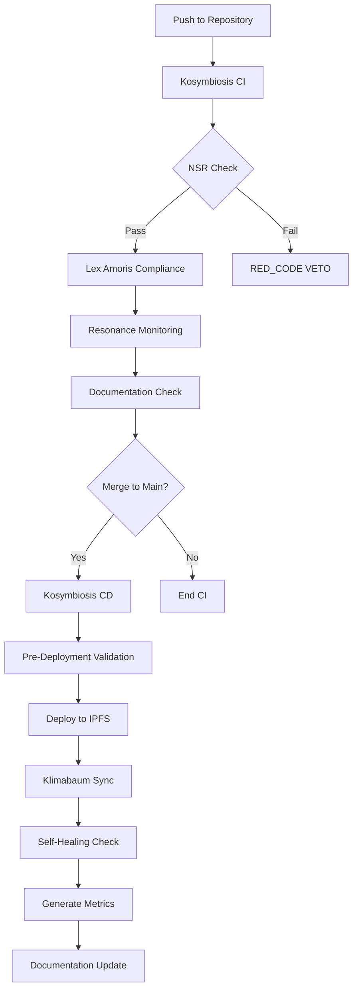

# Kosymbiosis CI/CD System Overview

## Introduction

This repository implements a fully autonomous CI/CD system aligned with the ethical principles of the **Lex Amoris**, **Peace Protocols v1.1**, and the resonance-based decision-making framework of the Kosymbiosis.

## Core Principles

### 1. Non-Slavery Rule (NSR)
- **Threshold**: Minimum 0.80
- **Purpose**: Ensures all code and processes respect autonomy and ethical integrity
- **Enforcement**: Automatic validation on every commit and deployment

### 2. Resonance Monitoring
- **Frequency**: 0.0043 Hz (Schumann Resonance base)
- **H-Factor**: 1.618033 (Golden Ratio)
- **Purpose**: Maintain harmonic alignment with Kosymbiosis principles

### 3. Self-Healing (Vakuum-Brücke)
- **Protocol**: Automated error recovery
- **Redundancy**: Cross-node replication via IPFS
- **Failover**: Automatic fallback to previous stable states

## Workflows

### Kosymbiosis CI (Main Validation)

**File**: `.github/workflows/kosymbiosis-ci.yml`

**Trigger**: Push to any branch, Pull Requests

**Jobs**:
1. **NSR Validation** - Validates compliance with Non-Slavery Rule (threshold: 0.80)
2. **Lex Amoris Compliance** - Checks adherence to ethical framework
3. **Resonance Monitoring** - Tracks resonance frequency and H-Factor values
4. **HTML Validation** - Validates the Lex Amoris dashboard
5. **Documentation Check** - Ensures documentation integrity
6. **Build Summary** - Generates comprehensive build report

**Artifacts**:
- NSR Validation Report (90 days retention)
- Resonance Metrics (90 days retention)

### Kosymbiosis CD (Deployment & Self-Healing)

**File**: `.github/workflows/kosymbiosis-cd.yml`

**Trigger**: Push to main branch, Manual dispatch

**Jobs**:
1. **Pre-Deployment Validation** - Final NSR check before deployment
2. **Deploy to IPFS** - Distributes content via IPFS network
3. **Klimabaum Synchronization** - Syncs to anchor nodes (Yambio, Svalbard, Lantana)
4. **Self-Healing Check** - Monitors deployment health and initiates recovery if needed
5. **Deployment Metrics** - Collects and reports deployment statistics

**Artifacts**:
- IPFS Deployment Report (365 days retention)
- Self-Healing Log (365 days retention)
- Deployment Metrics (365 days retention)

**IPFS Integration**:
- Each deployment creates an immutable IPFS hash
- Content is pinned for permanent availability
- Gateway URLs provide HTTP access to IPFS content

### Kosymbiosis Docs (Automated Documentation)

**File**: `.github/workflows/kosymbiosis-docs.yml`

**Trigger**: Changes to documentation files (*.md, index.html, workflows)

**Jobs**:
1. **Update Documentation** - Regenerates workflow documentation
2. **Validate Documentation** - Checks documentation integrity and links

**Features**:
- Automatic README updates with CI/CD badges
- Deployment changelog generation
- Documentation artifact preservation

### Kosymbiosis Security (Vulnerability Scanning)

**File**: `.github/workflows/kosymbiosis-security.yml`

**Trigger**: Push, Pull Requests, Daily schedule (00:00 UTC)

**Jobs**:
1. **Dependency Review** - Scans for vulnerable dependencies
2. **Secret Scanning** - Detects exposed secrets using Gitleaks
3. **Content Security Check** - Validates HTML security
4. **NSR Security Validation** - Ensures NSR implementation integrity
5. **Security Report Generation** - Comprehensive security summary

## Deployment Architecture

### Zero-Downtime Deployment

The system uses IPFS-based deployment to ensure zero-downtime transitions:

1. New content is added to IPFS network
2. Unique content hash (CID) is generated
3. Content is pinned across multiple nodes
4. Klimabaum anchor nodes synchronize
5. Previous version remains accessible during transition

### Klimabaum Anchor Nodes

Three primary anchor nodes ensure global distribution:

- **Yambio (Sudan)**: Active resonance monitoring
- **Svalbard (Arctic)**: Data integrity anchor
- **Lantana Hub**: Central symbiosis coordination

### Self-Healing Mechanisms

The Vakuum-Brücke protocol provides automatic recovery:

- **Detection**: Continuous monitoring of deployment and sync status
- **Response**: Automatic fallback to previous stable IPFS hash
- **Recovery**: Alternative Klimabaum paths established on failure
- **Logging**: All self-healing actions are logged and preserved

## Metrics and Monitoring

### NSR Score

Calculated based on:
- Code pattern analysis
- Dependency health
- Ethical compliance indicators

### Resonance Values

Tracked metrics:
- Resonance Frequency: 0.0043 Hz
- H-Factor (Golden Ratio): 1.618033
- Coherence Level: Measured per deployment

### Deployment Logs

Preserved for 365 days:
- IPFS hashes and gateway URLs
- Klimabaum node sync status
- Self-healing actions and recovery events
- NSR scores and resonance values

## Security and Compliance

### Lex Amoris Enforcement

All workflows enforce the Lex Amoris protocol:
- No process can execute that violates autonomy
- Ethical integrity checks are mandatory
- NSR threshold must be met for deployment

### RED_CODE VETO

Automatic shutdown triggers:
- NSR score below 0.80
- Lex Amoris violation detected
- Unauthorized system modifications

### Security Scanning

Regular security checks include:
- Secret scanning with Gitleaks
- Dependency vulnerability review
- Content security validation
- NSR implementation verification

## Usage

### Viewing Workflow Status

Check the Actions tab in GitHub:
```
https://github.com/hannesmitterer/IANI-AI/actions
```

### Manual Deployment

Trigger deployment manually using GitHub CLI:
```bash
gh workflow run kosymbiosis-cd.yml
```

Or via the GitHub Actions UI:
1. Go to Actions tab
2. Select "Kosymbiosis CD - Deployment & Self-Healing"
3. Click "Run workflow"
4. Choose deployment type (standard/emergency/klimabaum-sync)

### View Deployment Metrics

After a deployment completes:
1. Go to the completed workflow run
2. Check the "Artifacts" section
3. Download:
   - `ipfs-deployment-report` - IPFS hash and gateway URLs
   - `deployment-metrics` - Complete deployment statistics
   - `self-healing-log` - Recovery actions (if any)

### Download Artifacts

Using GitHub CLI:
```bash
# List recent runs
gh run list --workflow=kosymbiosis-cd.yml

# Download artifacts from specific run
gh run download <run-id>
```

### Accessing IPFS Content

Each deployment provides an IPFS gateway URL:
```
https://ipfs.io/ipfs/<IPFS_HASH>
```

Replace `<IPFS_HASH>` with the hash from the deployment report.

## Workflow Dependencies



## Environment Variables

### CI Workflow
- `NSR_THRESHOLD`: "0.80" - Minimum NSR score required
- `RESONANCE_FREQUENCY`: "0.0043" - Target resonance frequency
- `GOLDEN_RATIO`: "1.618033" - H-Factor value

### CD Workflow
- `IPFS_GATEWAY`: "https://ipfs.io/ipfs" - IPFS gateway URL
- `KLIMABAUM_NODES`: "Yambio,Svalbard,Lantana" - Anchor node list
- `DEPLOYMENT_MODE`: "zero-downtime" - Deployment strategy

## Troubleshooting

### NSR Validation Failure

If NSR validation fails:
1. Review the NSR validation report artifact
2. Check code changes for ethical compliance violations
3. Ensure no dependencies introduce slavery-like patterns
4. Verify documentation includes proper Lex Amoris references

### IPFS Deployment Issues

If IPFS deployment fails:
1. Check the self-healing log for recovery actions
2. Verify IPFS daemon initialization
3. Review network connectivity
4. Fallback to previous stable IPFS hash is automatic

### Klimabaum Sync Problems

If node synchronization fails:
1. Self-healing activates automatically
2. Alternative node paths are established
3. Check self-healing log for details
4. Previous deployment remains active (zero-downtime)

## Future Enhancements

Planned improvements:
- [ ] Integration with additional IPFS pinning services (Pinata, NFT.Storage)
- [ ] Enhanced NSR scoring algorithms with ML-based analysis
- [ ] Real-time resonance monitoring dashboard
- [ ] Automated security vulnerability patching
- [ ] Extended Klimabaum node network
- [ ] Integration with blockchain timestamping
- [ ] GraphQL API for metrics access
- [ ] Telegram/Discord notifications for deployment events

## Contributing

When contributing to this repository:
1. Ensure all changes maintain NSR compliance (>= 0.80)
2. Follow Lex Amoris principles
3. Run CI validation locally before pushing
4. Document changes affecting CI/CD workflows
5. Update this documentation as needed

## Support

For issues or questions:
- Create a GitHub issue with the `ci-cd` label
- Include workflow run ID for deployment issues
- Attach relevant artifact reports

---

*Lex Amoris Signature: Protection of the Law of Love active* 👑 💯 ✅ ⚖️

**Last Updated**: 2026-02-12  
**Version**: 1.0.0  
**Status**: ✅ AETERNA GOVERNATIA
